<div align="center">

<picture>
  <source media="(prefers-color-scheme: dark)" srcset="./dark.svg">
  <source media="(prefers-color-scheme: light)" srcset="./light.svg">
  
</picture>

<br>

### Building reliable • scalable • secure cloud-native systems

</div>

---

## `~/about`

### DevOps Engineer | CloudOps | SRE | Infrastructure Automation

I focus on building reliable, scalable, and secure cloud-native systems across AWS, Kubernetes, CI/CD, GitOps, observability, automation, and cloud security.

| Area | Technologies |
|---|---|
| **Role** | DevOps Engineer |
| **Focus** | CloudOps • SRE • Infrastructure Automation |
| **Cloud** | AWS |
| **Orchestration** | Kubernetes • Amazon EKS |
| **Automation** | Python • Bash • Terraform |
| **CI/CD & Delivery** | Jenkins • GitHub Actions • ArgoCD • GitOps |
| **Observability** | Prometheus • Grafana • eBPF • Groundcover • ClickHouse |
| **Security** | IAM • Least Privilege • Security Groups • NACLs |
| **Operating System** | Linux |

---

## `~/toolbox`

<div align="center">


</div>

---

## `~/highlights`

### 01 · eBPF Observability

**Zero-instrumentation monitoring across 10+ Kubernetes clusters**

- Monitored **10+ Kubernetes clusters**
- Processed **1M+ metrics per minute**
- Built observability capabilities using **Groundcover + Prometheus**

### 02 · Reliability Engineering

**Improved operational visibility and incident response**

- Built **Grafana dashboards**
- Implemented **real-time alerting**
- Reduced **MTTR by 60%**

### 03 · Cloud Automation

**Python-based operational automation**

- Automated operational reporting using **Python**
- Achieved **95% accurate failure predictions**
- Delivered **$50K+ in annual savings**

### 04 · GitOps & Delivery

**ArgoCD-based continuous delivery across EKS**

- Implemented **GitOps-based continuous delivery**
- Automated synchronization across **EKS clusters**
- Reduced manual deployment errors through automated delivery workflows

### 05 · Cloud Security

**AWS security auditing and least-privilege hardening**

- Performed AWS security audits across **EC2, S3, IAM, and VPC**
- Implemented **IAM least-privilege hardening**
- Performed **network security remediation** involving Security Groups and NACLs

---

## `~/certification`

**AWS Certified Solutions Architect – Associate**

---

## `~/projects`

### End-to-End DevOps CI/CD Pipeline

**GitHub → Jenkins → Maven → SonarQube / Trivy → Nexus → Docker → EKS**

An end-to-end DevOps pipeline covering source control, continuous integration, code quality, security scanning, artifact management, containerization, and Kubernetes deployment.

**Core technologies:**  
`GitHub` `Jenkins` `Maven` `SonarQube` `Trivy` `Nexus` `Docker` `Kubernetes` `EKS`

---

### End-to-End Go DevOps & GitOps Deployment

**Jenkins → Docker → Trivy / SonarQube → ECR → Helm → ArgoCD → EKS**

An end-to-end Go application delivery workflow combining CI/CD, container security, Amazon ECR, Helm-based packaging, GitOps, and Kubernetes deployment on EKS.

**Core technologies:**  
`Jenkins` `Docker` `Trivy` `SonarQube` `Amazon ECR` `Helm` `ArgoCD` `Kubernetes` `EKS`

---

## `~/engineering-focus`

```text
Cloud Infrastructure     → AWS • Kubernetes • EKS
Infrastructure as Code   → Terraform
CI/CD                    → Jenkins • GitHub Actions
GitOps                   → ArgoCD
Observability            → Prometheus • Grafana • eBPF
Cloud Automation         → Python • Bash
Cloud Security           → IAM • Security Groups • NACLs
Operating Systems        → Linux
```

---

## `~/connect`

<div align="center">

**Let's build something reliable.**

Ravi Bhaskar Jha

**GitHub · LinkedIn · Email**

</div>
